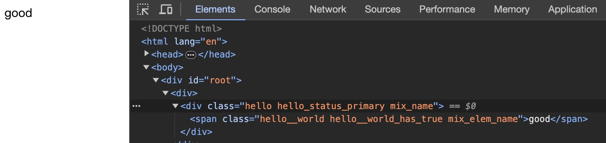

# BEM

## 什么是BEM
BEM是一种命名规范，为了解决CSS中混乱的命名方式，达到命名语义化的效果。

BEM是三个单词的缩写：Block（块）代表更高级别的抽象或组件，Element（元素） Block的后代，以及Modifier（修饰） 不同状态的修饰符。

## 组成
BEM 的 Block 代表边界或组件，主要功能：
- 负责描述功能
- 不包含具体样式
- 不能使用元素或ID选择器

Element：
- 表示目的而不是状态
- 不能脱离Block父级单独使用

Modifier：
- 表示状态
- 不能脱离父级单独使用

例如：
```sass
.header {
    &__body {
        padding: 20px;
    }
​
    &__button {
        &--primary {
            background: #329FD9;
        }
        &--default {
            background: none;
        }
    }
}
```

## 示例
BEM只是一个规范，没有原理上的东西，如果要使用它只需要我们在定义样式的时候遵守命名层级规范即可。
但单纯的使用命名未免有些单调，我在`label-studio-frontend`项目中发现了他们对BEM的使用，设计的稍显复杂但值得学习，接下来从`label-studio-frontend`中的实现来看看在项目中怎么合理的使用BEM

首先来看一下BEM组件的定义：
```ts
import {
  ComponentClass,
  Context,
  createContext,
  createElement,
  CSSProperties,
  FC,
  forwardRef,
  FunctionComponent,
  ReactHTML,
  ReactSVG,
  useContext
} from 'react';


const CSS_PREFIX = process.env.CSS_PREFIX ?? 'dm-';

const assembleClass = (block: string, elem?: string, mix?: CNMix | CNMix[], mod?: CNMod) => {
  const rootName = block;
  const elemName = elem ? `${rootName}__${elem}` : null;

  const stateName = Object.entries(mod ?? {}).reduce((res, [key, value]) => {
    const stateClass = [elemName ?? rootName];

    if (value === null || value === undefined) return res;

    if (value !== false) {
      stateClass.push(key);

      if (value !== true) stateClass.push(value as string);

      res.push(stateClass.join('_'));
    }
    return res;
  }, [] as string[]);

  const finalClass: string[] = [];

  finalClass.push(elemName ?? rootName);

  finalClass.push(...stateName);

  if (mix) {
    const mixes = Array.isArray(mix) ? mix : [mix];
    const mixMap = ([] as CNMix[])
      .concat(...mixes)
      .filter(m => {
        if (typeof m === 'string') {
          return m.trim() !== '';
        } else {
          return m !== undefined && m !== null;
        }
      })
      .map(m => {
        if (typeof m === 'string') {
          return m;
        } else {
          return m?.toClassName?.();
        }
      })
      .reduce((res, cls) => [...res, ...cls!.split(/\s+/)], [] as string[]);

    finalClass.push(...Array.from(new Set(mixMap)));
  }

  const attachNamespace = (cls: string) => {
    if (new RegExp(CSS_PREFIX).test(cls)) return cls;
    else return `${CSS_PREFIX}${cls}`;
  };

  return finalClass.map(attachNamespace).join(' ');
};

const BlockContext = createContext<CN | null>(null);

export const cn = (block: string, options: CNOptions = {}): CN => {
  const { elem, mix, mod } = options ?? {};
  const blockName = block;

  const classNameBuilder: CN = {
    block(name) {
      return cn(name, { elem, mix, mod });
    },

    elem(name) {
      return cn(block, { elem: name, mix, mod });
    },

    mod(newMod = {}) {
      const stateOverride = Object.assign({}, mod ?? {}, newMod);

      return cn(block ?? blockName, { elem, mix, mod: stateOverride });
    },

    mix(...mix) {
      return cn(block, { elem, mix, mod });
    },

    select(root = document) {
      return root.querySelector(this.toCSSSelector());
    },

    selectAll(root = document) {
      return root.querySelectorAll(this.toCSSSelector());
    },

    closest(root) {
      return root.closest(this.toCSSSelector());
    },

    toString() {
      return assembleClass(
        block,
        elem,
        mix,
        mod,
      );
    },

    toClassName() {
      return this.toString();
    },

    toCSSSelector() {
      return `.${this.toClassName().replace(/(\s+)/g, '.')}`;
    },
  };

  Object.defineProperty(classNameBuilder, 'Block', { value: Block });
  Object.defineProperty(classNameBuilder, 'Elem', { value: Elem });
  Object.defineProperty(classNameBuilder, '__class', { value: {
    block,
    elem,
    mix,
    mod,
  } });

  return classNameBuilder;
};

export const BemWithSpecifiContext = (context?: Context<CN | null>) => {
  const Context = context ?? createContext<CN|null>(null);

  const Block = forwardRef(<T extends FC<any>, D extends TagNames>({
    tag = 'div',
    name,
    mod,
    mix,
    ...rest
  }: WrappedComponentProps<T, D>, ref: any) => {
    const rootClass = cn(name);
    const finalMix = ([] as [ CNMix? ]).concat(mix).filter(cn => !!cn);
    const className = rootClass.mod(mod).mix(...(finalMix as CNMix[]), rest.className).toClassName();
    const finalProps = { ...rest, ref, className } as any;

    return createElement(Context.Provider, {
      value: rootClass,
    }, createElement(tag, finalProps));
  });

  const Elem = forwardRef(<T extends FC<any>, D extends TagNames>({
    tag = 'div',
    component,
    block,
    name,
    mod,
    mix,
    ...rest
  }: WrappedComponentProps<T, D>, ref: any) => {
    const blockCtx = useContext(Context);

    const finalMix = ([] as [ CNMix? ]).concat(mix).filter(cn => !!cn);

    const className = (block ? cn(block) : blockCtx)!
      .elem(name)
      .mod(mod)
      .mix(...(finalMix as CNMix[]), rest.className)
      .toClassName();

    const finalProps: any = { ...rest, ref, className };

    if (typeof tag !== 'string') finalProps.block = blockCtx;
    if (component) finalProps.tag = tag;

    return createElement(component ?? tag, finalProps);
  });

  Block.displayName = 'Block';

  Elem.displayName = 'Elem';

  return { Block, Elem, Context };
};

export const { Block, Elem } = BemWithSpecifiContext(BlockContext);

export const useBEM = () => {
  return useContext(BlockContext)!;
};

```

可以看到，该组件定义了两个组件：`Block`、`Elem`，从名字来看直接对应Block和Element
另外还有工具函数：
- cn：即classNameBuilder
- assembleClass：生成最终的className

接下来看看这个组件是怎么设计的：
`BemWithSpecifiContext`函数创建了`Block`和`Elem`组件，他需要一个`context`，这个context对Block用来存储`rootClass`
`Block`组件主要需要以下参数：
- tag：创建的外层容器的标签，默认div
- name：用于生成className
- mod：状态相关的样式
- mix：表示需要混入的className

Block怎么处理这些参数呢？
首先，Block 作为BEM的根，会根据传入的name生成一个 rootClass，也就是 classNameBuilder 实例，子元素的类名都会在这个基础上构建
接下来处理要混入的类名
然后通过rootClass生成最终的类名，这期间会处理 mod 和 mix
最后生成DOM，最外层是 context，子元素是 tag 代表的标签，然后把所有的Block不相关的参数加到 tag 的组件或元素上

再来看看`Elem`：
参数为：
- `tag`：创建的容器的标签
- `component`：可选，组件
- `block`：要使用的 block Context，一般通过外层的 Block 组件获取
- `name`：类名
- `mod`：状态名
- `mix`：混入的类名

Elem 会先找到外层的 block，如果参数有传入，使用传入的，没有的话就使用外层 block
接下来处理混入的类
然后根据传入的 name、mod等通过classNameBuilder获得最终的类名

接着处理剩余参数，根据提供的component或tag创建元素

以上是两个组件的定义，但还有一个关键的部分，就是`classNameBuilder`，接下来看看`cn`函数，了解cnBuilder的作用
cn 函数有两个参数：
- block：Block 的名字，用于构建类名
- options：配置，包含elem名称、混入、和状态相关的样式

cn 内部有一个对象`classNameBuilder`，这就是奥妙所在
cnb 提供了很多方法，一一解析可能不能使人明白，以下使用一个实际的例子来探索类名构建的过程：
```html
<Block
  name="hello"
  mod={{status: 'primary'}}
  mix="mix_name"
>
  <Elem
    name="world"
    tag="span"
    mod={{has: 'true'}}
    mix="mix_elem_name"
  >good</Elem>
</Block>
```
假如有以上一段代码，使用了Block和Elem来生成dom
先看看Block处理参数的过程：
1. 调用`cn(name)`函数生成`rootClass`，也就是一个csb实例
2. 处理混入类名，应该会得到`mix_name`
3. 通过`rootClass`构建`className`，这一步就是cnb的功劳了
   1. 调用`mod(mod)`，通过之前的分析可知，cnb的`blockName`为`hello`，调用mod方法后，会给cnb增加mod信息，返回包含合并配置的新cnb
   2. 调用`mix`函数，与mod相同，也会返回更新配置后的新cnb
   3. 调用`toClassName`方法生成类名，这个方法较为复杂，实际上是`assembleClass`函数
      1. Block和Elem的处理是不同的，区别在与类名的层级，Block直接使用block作为rootName，Elem会拼接elem作为原始类名
      2. 接着处理mod，mod是一个对象，会判断这个对象每一个属性的value，如果value符合条件，就将拼接成`key_value`的数组
      3. 接着处理mix，mix是字符串或字符串数组，或cnb实例，在对mix的每一项检测后返回符合要求的类名数组
      4. 最后所有的处理过的类名会放到数组`finalClass`里，给每一个类名加上前缀后用空格拼接起来就成为了最终的类名列表
   
这就是完整的处理类名的流程，Elem的处理也是一样的

这个例子最终的DOM如下：
