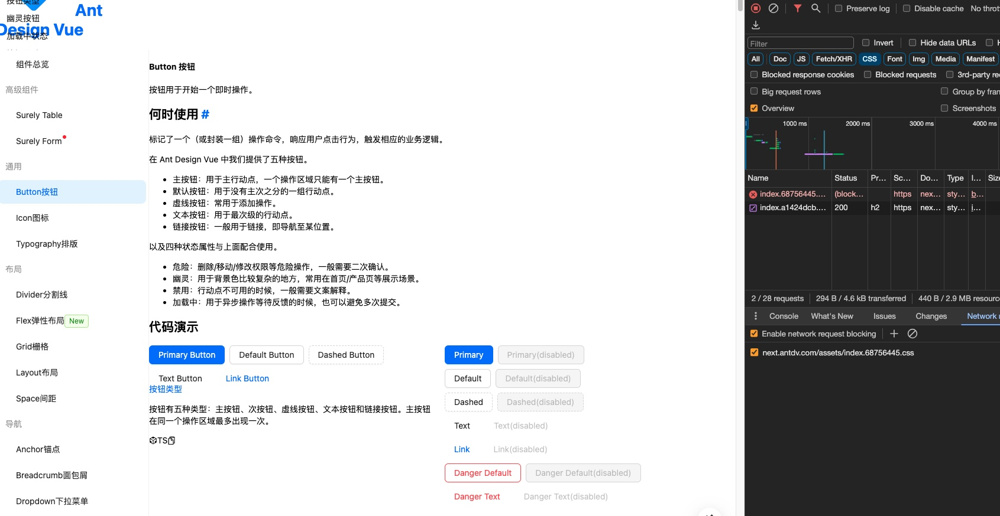

# Antd v4 的CIJ学习

Antd v4 做了一些技术调整，其中有例如去除less，采用CIJ。这一改动带来的变化有：
- 所有 less 文件全部移除，less 变量不再支持透出。
- 产物中不再包含 css 文件。

在浏览器工具中，禁用CSS文件的请求后在打开Antd的页面，会发现页面的样式失效，但组件的样式还是正常的，说明组件相关的样式是在运行时添加到文档中的。



## 探索
我们选择一个组件，就选`Card`吧，该组件较为简单，我们只是研究CIJ，比较方便。
看看Card的实现：
```jsx
const Card = defindComponent({
  setup(props) {
    const { prefixCls, direction, size } = useConfigInject('card', props);
    const [wrapSSR, hashId] = useStyle(prefixCls);

    return () => {
      const pre = prefixCls.value;
      const classString = {
        [`${pre}`]: true,
        [hashId.value]: true,
        [`${pre}-loading`]: loading,
        [`${pre}-bordered`]: bordered,
        [`${pre}-hoverable`]: !!hoverable,
        [`${pre}-contain-grid`]: isContainGrid(children),
        [`${pre}-contain-tabs`]: tabList && tabList.length,
        [`${pre}-${size.value}`]: size.value,
        [`${pre}-type-${type}`]: !!type,
        [`${pre}-rtl`]: direction.value === 'rtl',
      };

      return wrapSSR(
        <div ref="cardContainerRef" {...attrs} class={[classString, attrs.class]}>
          {head}
          {coverDom}
          {children && children.length ? body : null}
          {actionDom}
        </div>
      )
    }
  }
})
```

以上只选取了部分关键代码。
可以发现，最终在DOM上生效的class来自`classString`，classString是组件开发者自己定义的，是根据组件的需求来设置的className集合。
classString的定义使用了`pre`，也就是`prefixCls`，这个值来自`useConfigInject`函数。
useConfigInject 是一个自定义hook，用来获取样式相关配置，我们主要来看Card组件使用的`prefixCls`值。
useConfigInject 首先会获取 configProvider，然后调用`getPrefixCls`方法获取值，在Card中提供了name为`card`，所以最终获取的值是`ant-card`

接着Card组件会调用另一个自定义 hook `useStyle`，并传入 prefixCls
这个hook来自该组件的样式定义文件，但实际上是一个gen函数生成的，即`genComponentStyleHook`.

genComponentStyleHook 函数接收两个必选参数：
- component： 组件名称，本例为 Card
- styleFn： 用于生成样式

返回一个函数，也就是 hook，来看看这个hook：
```ts
return (_prefixCls?: Ref<string>): UseComponentStyleResult => {
    const prefixCls = computed(() => _prefixCls?.value);
    const [theme, token, hashId] = useToken();
    const { getPrefixCls, iconPrefixCls } = useConfigContextInject();
    const rootPrefixCls = computed(() => getPrefixCls());
    const sharedInfo = computed(() => {
      return {
        theme: theme.value,
        token: token.value,
        hashId: hashId.value,
        path: ['Shared', rootPrefixCls.value],
      };
    });
    // Generate style for all a tags in antd component.
    useStyleRegister(sharedInfo, () => [
      {
        // Link
        '&': genLinkStyle(token.value),
      },
    ]);
    const componentInfo = computed(() => {
      return {
        theme: theme.value,
        token: token.value,
        hashId: hashId.value,
        path: [component, prefixCls.value, iconPrefixCls.value],
      };
    });
    return [
      useStyleRegister(componentInfo, () => {
        const { token: proxyToken, flush } = statisticToken(token.value);

        const defaultComponentToken =
          typeof getDefaultToken === 'function'
            ? (getDefaultToken as any)(proxyToken)
            : getDefaultToken;
        const mergedComponentToken = { ...defaultComponentToken, ...token.value[component] };

        const componentCls = `.${prefixCls.value}`;
        const mergedToken = mergeToken<
          TokenWithCommonCls<GlobalTokenWithComponent<OverrideComponent>>
        >(
          proxyToken,
          {
            componentCls,
            prefixCls: prefixCls.value,
            iconCls: `.${iconPrefixCls.value}`,
            antCls: `.${rootPrefixCls.value}`,
          },
          mergedComponentToken,
        );
        const styleInterpolation = styleFn(mergedToken as unknown as FullToken<ComponentName>, {
          hashId: hashId.value,
          prefixCls: prefixCls.value,
          rootPrefixCls: rootPrefixCls.value,
          iconPrefixCls: iconPrefixCls.value,
          overrideComponentToken: token.value[component],
        });
        flush(component, mergedComponentToken);
        return [genCommonStyle(token.value, prefixCls.value), styleInterpolation];
      }),
      hashId,
    ];
  };
```

这个 hook 的返回值就是 Card 组件中出现的 `wrapSSR` 和 `hashId`

其中 hashId 来自 `useToken`

